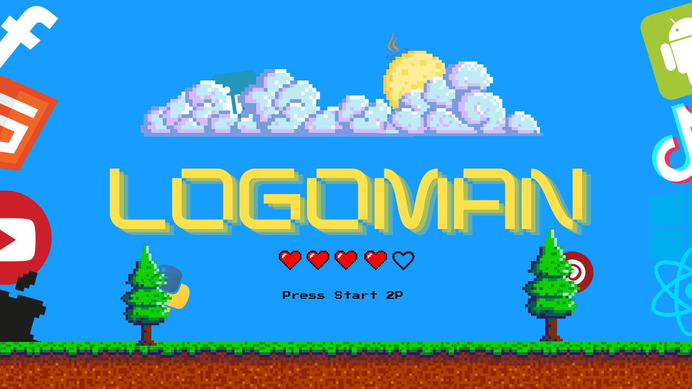

# LOGOMAN 👀

---
### RESUMEN
#### Logoman es un juego que tiene como objetivo acertar a el logo correcto, consta de 5 vidas , si el usuario acierta el logo se suman monedas y en el caso que no se acierte se resta una , De quedarse sin vidas el juego termina. El jugador puede utilizar 3 comodines a su favor
- #### RESPUESTA : Revela la respuesta pero no otorga monedas
- #### HALF : Revela 2 cuadros incorrectos
- #### NEXT : Pasa al siguiente y te suma menos cantidad de monedas
#### Al acertar todos los logos el juego termina
---

### DESARROLLO DEL VIDEOJUEGO
#### La creacion de este videojuego conllevo muchas cosas debimos aplicaR tipos de datos avanzados (listas,diccionarios,etc) tambien debimos hacer uso de muchas funciones ya que nuestro juego pasaba las **600 lineas** y gracias a esto pudimos lograr que el mismo baje de 500, tuvimos que normalizar datos y hacer muchisimas validaciones para hacer eficiente la jugabilidad del mismo. Usamos ARCHIVOS CSV para guardar el score por partida ,Matrices para la gestion de banderas y un diccionario para gestionar las imagenes, entre otras cosas. Desde lo visual es un juego muy llamativo por las imagenes que contiene y la cantidad de detalles que tiene, para lograr esto nos ayudamos con CANVA y pudimos lograr la cantidad de detalles inmersivos que contiene que son muy esteticos. Al juego le agregamos sonidos y sonido de ambiente (El cual se puede regular desde la ventana de opciones) que con cada interaccion se reproducen dependiendo de la accion. 
---
### FUNCIONES
#### Cuenta con:
- #### Pantalla Bienvenida (Iniciar, Salir , Ajustes)
- #### Pantalla Juego
- #### Game Over (Boton a inicio)
- #### Boton Menu (Pausa, Inicio)
---
### TECNOLOGIAS
- #### PYTOHN
- #### PYGAME
---
### MUESTRA DE JUEGO EN ACCION
- [GAMEPLAY](https://drive.google.com/file/d/17agN1lAwQESs_jnCytEr59ddlB1kPIOu/view?usp=sharing)
---
#### ESTE JUEGO FUE REALIZADO COMO TRABAJO POR LA UNIVERSIDAD

### **INTEGRANTES**
- *FACUNDO MAIDANA*
- *BRUNO CONDARCO*
---
